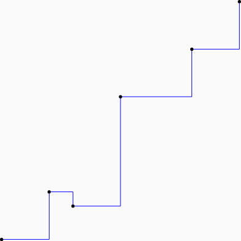
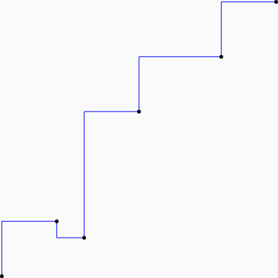

# Plot types

The library supports several plot types.

## line

`line(dataSet, color=Color.Black)`


## scatter

`scatter(dataSet, radius=1.dp, color=Color.Black)`


## area

`area(dataSet, brush=SolidColor(Color.Cyan))`


## step

Step graphs can be drawn with the step either after or before the
point.  This can be seem more easily when drawn in conjunction with a
scatter plot, i.e.

```kotlin
step(it, color=Color.Blue)
scatter(it, radius=1.dp, color=Color.Black)
```



```kotlin
step(it, color=Color.Blue, where=StepVertical.Pre)
scatter(it, radius=1.dp, color=Color.Black)
```

