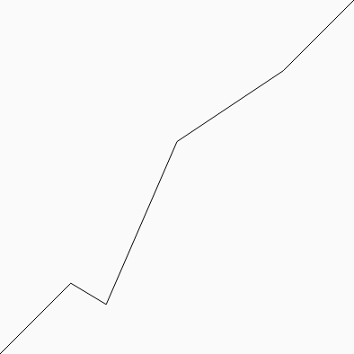
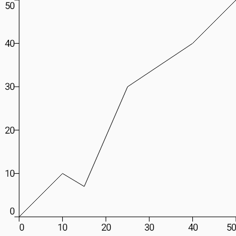

[](https://jitpack.io/#com.sanbeg/Composable-Charts)

# Composable Charts

This library provides a toolkit to generate data charts with Jetpack Compose.

# Usage

## Building

First, make sure the jitpack repository is included in your build; the
current recommendation is to add that in your `settings.gradle`.  If
it's not already included, and you want to include it for only this
library, you could include it as follows:

```kotlin
dependencyResolutionManagement {
    repositoriesMode.set(RepositoriesMode.FAIL_ON_PROJECT_REPOS)
    repositories {
        google()
        mavenCentral()
        maven {
            url = uri("https://jitpack.io")
            content {
                includeGroup("com.sanbeg.Composable-Charts")
            }
        }
    }
}
```

Then, add the dependency to your project in the usual way.  The
simplest would simply be to add a line like:

```kotlin
implementation("com.sanbeg.Composable-Charts:composable-chart:+")
```

Of course, you can get the latest version from the badge at the top of
this file, and add it to your version catalog in the usual way.

## Basic Example

To create a chart, we'll start with an example data set.

```kotlin
import com.sanbeg.composable_chart_data.asDataSet
import com.sanbeg.composable_chart_data.geometry.Point

private val chartData = listOf(
        Point(0f, 0f),
        Point(10f, 10f),
        Point(15f, 7f),
        Point(25f, 30f),
        Point(40f, 40f),
        Point(50f, 50f)
    ).asDataSet()
```

Here, the `Point` class represents the x and y coordinates of each
data point, in whatever logical units we want to represent in our
chart.  The `List.asDataSet()` extension allows us to present our list
as a `DataSet`, which is a simple interface used by the charts.  While
in this case since we're using a small set, we just use the `List`
wrapper; if we were using larger sets, we'd likely use one of the more
performant implementations which avoids boxing our data.

Once we have this data, we can render it in a chart, like this:

```kotlin
import com.sanbeg.composable_chart.core.xRange
import com.sanbeg.composable_chart.core.yRange
import com.sanbeg.composable_chart.plots.line
import com.sanbeg.composable_chart_data.xRange
import com.sanbeg.composable_chart_data.yRange

       Chart(
            Modifier
                .size(150.dp)
                .xRange(chartData.xRange())
                .yRange(chartData.yRange())
        ) {
            Plot {
                line(chartData)
            }
        }

    }
```

This produces




`Chart` is the layout that ties all of our components together.  You
can think of it sort of like a `Box` with 5 slots.  The center slot
contains our chart data, and is matched to the size of the chart,
either by setting the Chart size and letting its child expand to fit
it, or by specify the size of the plot and allowing the Chart to wrap
it.  The 4 edge slots match the center slot in one direction, to
ensure any axis we draw in those slots can align with the data.

The `xRange` and `yRange` modifiers specify the logical range of the
chart; i.e. which values would correspond to the lower left and upper
right corners of the chart.  The data will then be auto-scaled to
match the data.

A `Plot` is the component which performs the scaling, as well as
providing a drawing surface on which our chart is drawn.  Note that
the Plots contents are not `@Composable`; rather, this is a type of
immediate-mode interface, where each function within the plot is drawn
directly onto its surface.

Note that we can call multiple plotting functions from within each
`Plot`, either to draw multiple data sets, or draw the same data set
in multiple styles, such as with lines and points.

In this example we're plotting a line, but we support [several types](https://github.com/sanbeg/Composable-Charts/wiki/Plot-tpes).

We can also have multiple Plots within a chart, such as if we want to
compare data sets with different scales, we could create another Plot,
and specify a seperate `Modifier.yRange`.

## Axis

As noted, the charts can also be aligned with an axis.  For example,

```kotlin
        Chart(
            Modifier
                .size(150.dp)
                .xRange(chartData.xRange())
                .yRange(chartData.yRange())
        ) {
            Plot {
                line(chartData, color=Color.Black)
            }
            val measurer = rememberTextMeasurer()
            LeftAxis(Modifier.width(12.dp)) {
                drawLabelledTics(spacing = 10f, textMeasurer = measurer,)
            }
            BottomAxis(Modifier.height(12.dp)) {
                drawLabelledTics(10f, measurer, format = "%.0f")
            }
        }
```

produces



## Further Reading

Additonal documentation is in the [wiki](https://github.com/sanbeg/Composable-Charts/wiki) and [kdocs](https://sanbeg.github.io/Composable-Charts/)
